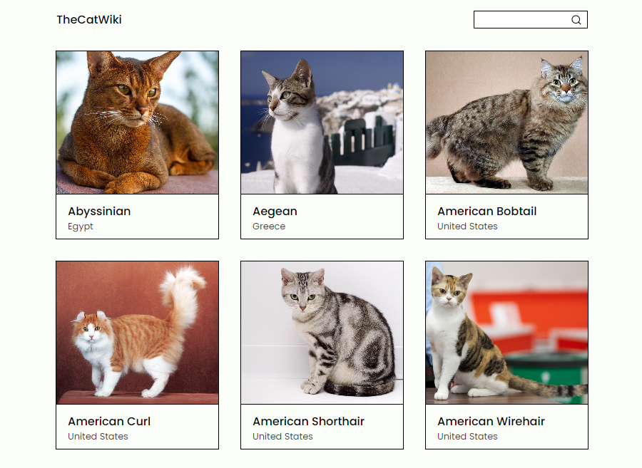
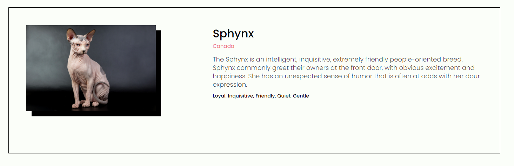

# TheCatWiki | Find information about your favorite cat breed 🐱‍👓

## About 🍣
**This project allows you find information about different cat breeds in the world.**

## Technologies used in this project 🍜
- React
- Styled-Components
- React-Router
- TheCatAPI (https://thecatapi.com/)

## Features 🍱
- **Search input**
- **General information about different breeds**
- **Specific information about a breed**
- **Pagination**

## Screenshots 🍚

## Learned 💫

- [x] **Pagination**
- [x] **Search**
- [x] **Separation of component logic with Custom Hooks**
